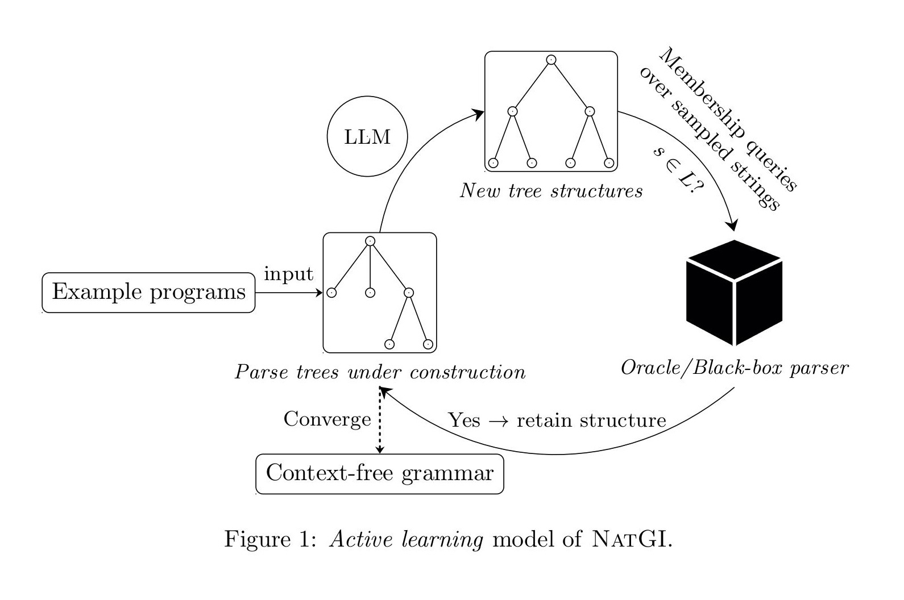

# NatGI Overview

NatGI infers context-free grammars from example programs using only black‑box access to the language parser (an oracle). It leverages the parse‑tree recovery strategies from Arvada/TreeVada to produce  human‑readable grammars with semantically meaningful nonterminal names.




Key features
- Needs few example programs and an oracle, the oracle is a command that accepts a filename and returns 0 for valid inputs.
- Relies on LLM to build parse-trees of the example programs.
- Reads off the inferred grammar once the parse-tree recovery process has converged.
- Produces human-readable grammars with meaningful non-terminals and (optionally) ANTLR4 output for downstream use.

This repository is built on the Arvada/TreeVada approach to grammar inference and aims to make inferred grammars easier to inspect and use in downstream tooling.

## Requirements

Requires at least python 3.10. Install the following two packages via pip to make sure everything runs:
```
$ pip3 install lark-parser tqdm openai PrettyPrintTree
```
(Optional) for using python target of antlr4 parser
```
pip3 install antlr4-python3-runtime==4.9.2
```

## Quickstart

NatGI takes a directory of example programs (TRAIN_DIR) and an oracle command (ORACLE_CMD). The oracle must be invocable as:

- `ORACLE_CMD filename` — runs the oracle on the file `filename`
- return 0 for valid examples, non‑zero for invalid examples
 
`Search.py` is the entry point to the tool. To learn a grammar run:
```
$ python3 search.py ORACLE_CMD TRAIN_DIR LOG_FILE
```
This writes training details to `LOG_FILE` and saves the learned grammar as a pickled dictionary in `LOG_FILE.gramdict`. For more configurable options, run `python3 search.py --help`


If you also have a held-out test set in `TEST_DIR`, you can evaluate the precision and recall of the mined grammar with the utility `eval.py`. This utility also handily prints out the unpickled grammar to `LOG_FILE.eval` file. The provided `LOG_FILE` must match one generated by search.py, as this utility looks for `LOG_FILE.gramdict`. 
```
$ python3 eval.py external [--no-antlr4] [-n PRECISION_SET_SIZE] ORACLE_CMD TEST_DIR LOG_FILE
```
- `PRECISION_SET_SIZE` (optional) is the number of samples to draw from the learned grammar to estimate precision (default: 1000).
- `TEST_DIR` is a directory of held-out valid programs. 
- `--no-antlr4` flag doesn't generate antlr4 grammar. Otherwise antlr4 grammar is written into a `.g4` file.


## Zero shot GPT-o4 (mini) grammar

Use a barebone LLM to infer grammar from the seeds.
1. Run `gpt.py` to get a text grammar.

```
python3 gpt.py SEED_DIR SEED_NAME   #python3 gpt.py Seed_Programs/tinyc/tinyc-train tinyc-r1
```
This writes a text grammar to `results/gpt_grammar_{SEED_NAME}.txt`.

2. Convert the text grammar into the pickled `.gramdict` format (uses ORACLE_CMD for lexical inference on the terminals):
```
python3 grammar_from_csv.py SEED_NAME ORACLE_CMD        #python3 grammar_from_csv.py tinyc-r1 Seed_Programs/tinyc/parse_tinyc
```
This produces a binary grammar file named results/gpt-grammar_{SEED_NAME}.gramdict.

3. Evaluate the saved grammar (precision/recall/F1) with the eval utility:
```
python3 eval.py external ORACLE_CMD TEST_DIR LOG_FILE   #python3 eval.py external Seed_Programs/tinyc/parse_tinyc Seed_Programs/tinyc/tinyc-test tinyc-r1
```
Here, `LOG_FILE` is the base name used for the .gramdict produced by step 2.
<!-- ## Acknowledgements

TreeVada is built upon its predecessor tool [Arvada](https://github.com/neil-kulkarni/arvada). Arvada is licensed under MIT license, please see the [Arvada License](https://github.com/neil-kulkarni/arvada/blob/master/LICENSE) for details. We thank the  developers [@carolemieux](https://github.com/carolemieux) and [@neil-kulkarni](https://github.com/neil-kulkarni) for their pioneering work. -->


